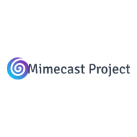
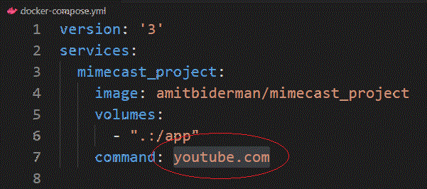

<!-- PROJECT LOGO -->
<br />
<p align="center">
  <a href="https://github.com/amitbiderman/screenshot_project">
    
  </a>

  <h3 align="center">Screenshot Program</h3>

  <p align="center">
   By Amit Biderman
  </p>
</p>


<!-- ABOUT THE PROJECT -->
## About The Project

[![Product Name Screen Shot][product-screenshot]](https://example.com)

A dockerized python application, that takes in a URL and saves a screenshot of the desired URL on the host's machine.

### Built With

*  [Docker](https://www.docker.com/m)
*  [Python](https://www.python.org/)
*  [Selenium](https://www.selenium.dev/)


<!-- GETTING STARTED -->
## Getting Started

You have two options to use it for your preference:

1. Clone this repository [Screenshot Project](https://github.com/amitbiderman/screenshot_project)
       * Installing Git is required for this step

2. Pull Docker image from [Docker Hub](https://hub.docker.com/) 

For both of these options Docker installation is required (Steps for installation are specified below)

Both steps are explained below

### Installing Docker

1. Install Docker [Documentation link](https://docs.docker.com/get-docker/):

* Windows
[Download the latest Docker Desktop for Windows](https://hub.docker.com/editions/community/docker-ce-desktop-windows/)

- Simply install after download is finished, restart your machine, and start the program.


* Linux Debian Using the Convenient Script
```sh
  $ url -fsSL https://get.docker.com -o get-docker.sh
  $ sudo sh get-docker.sh
  ```
  
* For other Linux Distributions Please Follow [This Link] (https://docs.docker.com/engine/install/)


* macOS
[Download the latest Docker Desktop for Mac](https://hub.docker.com/editions/community/docker-ce-desktop-mac/)

- Simply install after download is finished, restart your machine, and start the program.


### Cloning The Repository

If you don't have Git on your local machine:
* Windows

[Direct Download Link](https://git-scm.com/download/win)


* Linux Debian
```sh
  $ sudo apt install git-all
  ```
* Other Linux RPM-based Distributions
```sh
  $ sudo dnf install git-all
  ```
* macOS
```sh
  $ git --version
  ```


1. Create a new folder in your local machine.
2. Clone the repository
  ```sh
  git clone https://github.com/amitbiderman/screenshot_project.git
  ```

3. Build the image (This could take a couple of minutes)
  ```sh
  docker build -t <Your Image name:Your tag> .
  ```


### Pulling Image from Docker Hub

1. Create a new folder in your local machine.
2. Pull the image
  ```sh
  docker pull amitbiderman/mimecast_project:latest
  ```


<!-- USAGE EXAMPLES -->
## Usage
Since the purpose of the program is to go to a URL and take a screenshot, a URL is needed to be specified.

* You can either:

## Use docker run command

run the docker run command and specify volumes, image and URL at the end

If pulled image from DockerHub:
  ```sh
 docker run -v /app -v $(pwd):/app amitbiderman/mimecast_project <ENTER URL HERE>
  ```
If created your own image with the build command:
  ```sh
 docker run -v /app -v $(pwd):/app <Your Image name:Your tag> <ENTER URL HERE>
  ```
  
 
 ## Use docker-compose up command
 
1. Edit the docker-compose.yml file with your wanted URL: (replace youtube.com in the example with YOUR wanted URL !)

<a href="https://github.com/amitbiderman/screenshot_project">
    
  </a>

```sh
version: '3'
services:
  mimecast_project:
    image: amitbiderman/mimecast_project
    volumes:
      - ".:/app"
    command: youtube.com
```


2. And then  simply run:

  ```sh
  $ docker-compose up
  ```
